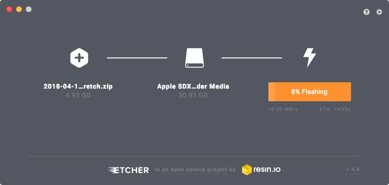
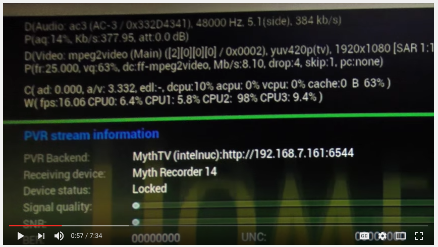
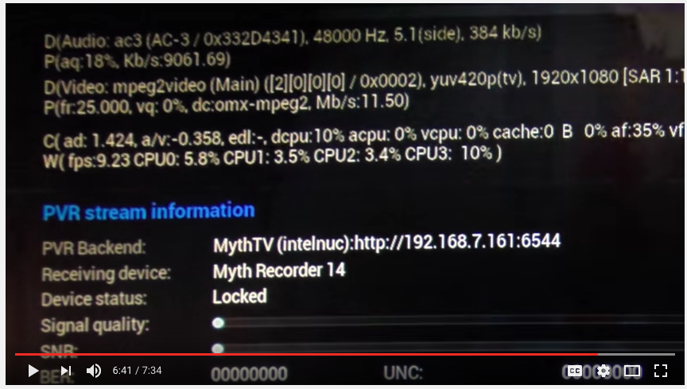
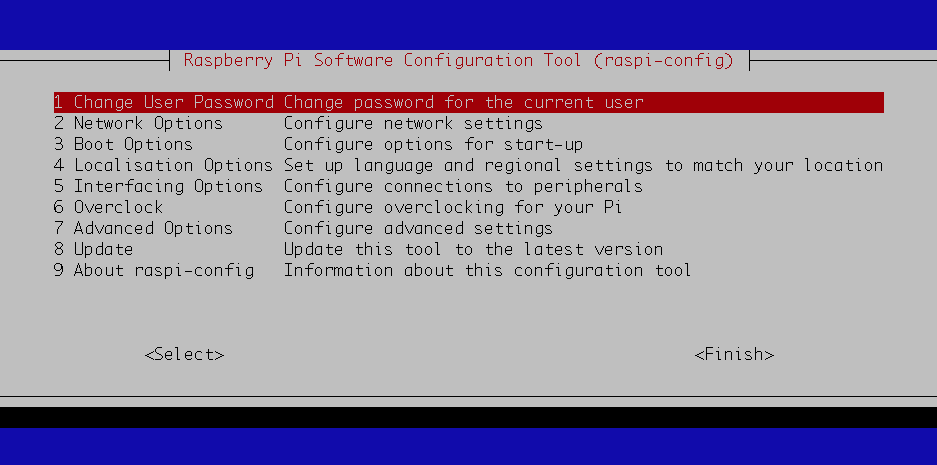

# Setting up a new Raspberry Pi from scratch

**Raspberry Pi Travel log:**

- label on rpi case: 
- location: 
- purpose: 
- rpi serial #:
- mpeg license: 
- hostname: 
- static IP addr: 
- MAC addr:
- rpi ssh alias: 
- ssh key name in `~/.ssh/blah.pub`:
- selenium version:
- matplotlib version:
- firefox-esr version:
- geckodriver version: 
- RAM: 
- num cpu cores: 
- initial version of raspbian: 

# test checkboxes

[ ] 1. foo
[ ] 2. bar
    [ ] 1. baz
    [ ] 2. marf
[ ] 3. gorg
[ ] 4. flag    

# Table of Contents

1. [ ] [Hardware setup](#1-hardware-setup)
    1. [ ] [Download Raspbian](#download-raspbian)
    1. [ ] [burn micro-SD card ](#burn-micro-sd-card )
        1. [ ] [Option 1: etcher](#option-1-etcher)
        1. [ ] [Option 2: dd](#option-2-dd)
    1. [ ] [MPEG license keys (Optional)](#mpeg-license-keys-optional)
    1. [ ] [Key generation for `ssh`](#key-generation-for-ssh)
    1. [ ] [Power up with keyboard, mouse, monitor](#power-up-with-keyboard-mouse-monitor)
2. [ ] [Configure linux (AS ROOT)](#2-configure-linux-as-root)
    1. [ ] [`raspi-config`](#raspi-config)
    1. [ ] [Change passwords](#change-passwords)
    1. [ ] [Require pw when sudo](#require-pw-when-sudo)
    1. [ ] [Capslock to ctrl](#capslock-to-ctrl)
    1. [ ] [key-repeat](#key-repeat)
    1. [ ] [bashrc](#bashrc)
    1. [ ] [sshd](#sshd)
    1. [ ] [static IP address](#static-ip-address)
    1. [ ] [root crontab](#root-crontab)
3. [ ] [Update software (AS ROOT)](#3-update-software-as-root)
    1. [ ] [plug in internet](#plug-in-internet)
    1. [ ] [update](#update)
    1. [ ] [firewall](#firewall)
    1. [ ] [install packages](#install-packages)
        1. [ ] [exim4 & mutt](#exim4-mutt)
4. [ ] [Configure a user](#4-configure-a-user)
    1. [ ] [user's bashrc](#users-bashrc)
    1. [ ] [python](#python)
    1. [ ] [git](#git)
        1. [ ] [set username & email](#set-username-email)
        1. [ ] [bash prompt shows git branch etc](#bash-prompt-shows-git-branch-etc)
        1. [ ] [aliases](#aliases)
        1. [ ] [colors](#colors)
5. [ ] [For headless web-browser driving (Selenium)](#5-for-headless-web-browser-driving-selenium)
    1. [ ] [install](#install)
        1. [ ] [geckodriver](#geckodriver)
    1. [ ] [Test headless (xvfb) selenium installation](#test-headless-xvfb-selenium-installation)

# 1. Hardware setup
## Download Raspbian

<https://www.raspberrypi.org/downloads/raspbian/>

Latest download: <https://downloads.raspberrypi.org/raspbian_latest>

## burn micro-SD card 
###  Option 1: etcher

<https://etcher.io/>

- Don't have to extract the .zip file, can give it directly to etcher.

###  Option 2: dd

1. Unzip `.zip` to extract the `.img` file
2. Insert micro-SD card
3. Find the location of the SD card in `/dev/`:

        (python3.4.1)Computron:~ justin$ diskutil list
        /dev/disk0
           #:                       TYPE NAME                    SIZE       IDENTIFIER
           0:      GUID_partition_scheme                        *500.3 GB   disk0
           1:                        EFI EFI                     209.7 MB   disk0s1
           2:                  Apple_HFS Macintosh HD            499.4 GB   disk0s2
           3:                 Apple_Boot Recovery HD             650.0 MB   disk0s3
        /dev/disk1
           #:                       TYPE NAME                    SIZE       IDENTIFIER
           0:     FDisk_partition_scheme                        *15.5 GB    disk1
           1:                 DOS_FAT_32 UNTITLED                15.5 GB    disk1s1

    In this example the 16 GB SD card is `/dev/disk1`. The other one, `/dev/disk0`, is my laptop HDD. 

4. Unmount the SD card by using the disk identifier to prepare copying data to it:

        diskutil unmountDisk /dev/disk1

    (or can use Mac's Disk Utility.)

5. Use the "raw" location `/dev/rdisk1` (note the extra `r` in `rdisk1`) in the `dd` command:

        (python3.4.1)Computron:~ justin$ date; sudo dd bs=1m \
        if=/Users/justin/Projects/Raspberry-pi-Raspbian-images/2018-04-18-raspbian-stretch.zip \
        of=/dev/rdisk1; date;

        Tue Nov  3 17:57:00 PST 2015
        292+0 records in
        292+0 records out
        306184192 bytes transferred in 8.355207 secs (36645914 bytes/sec)
        Tue Nov  3 17:57:08 PST 2015

Notes:

- Takes 10 min with class 4 SD card, 10 sec with class 10.
- You can check the progress by sending a SIGINFO signal pressing Ctrl+T.
- If the command fails somehow, try using `disk` instead of `rdisk`.
- If `resource busy` error, you need to unmount the SD card (but do not eject it) before running `dd`.
- If `dd: invalid number '1m'` error, use `1M` instead of `1m`.
- If `dd: /dev/rdisk1: Input/output error`, but `dd` continues to run, it might be ok.

## MPEG license keys (Optional)

**Optional: Hardware-decoding of MPG video**

Only do this part if you'll be playing or processing video on the RPi.

The following section comes from this YouTube video (note: in the video, he ssh's into the RPi to edit `/boot/config.txt`. It is easier to plug the SD card into a normal computer and edit it directly.)

<https://www.youtube.com/watch?v=3zToVK6U7AM>

The RPi is not powerful enough to play HD video without stuttering.

However, there is a solution:

The Raspberry Pi has an MPEG-decoder chip that allows you to hardware-accelerate the decoding of MPEG video. However, due to MPEG licensing reasons, this chip is disabled by default; you can pay $5 for an MPG license key to enable it. If you observe stuttering or skipping of MPG video, consider enabling the chip with the following procedure:

1. Find the RPI's serial number.

    - Option 1: from terminal

            (python3.2.3)pi@raspberrypi:/boot$ cat /proc/cpuinfo
            processor       : 0
            model name      : ARMv6-compatible processor rev 7 (v6l)
            BogoMIPS        : 2.00
            Features        : half thumb fastmult vfp edsp java tls
            CPU implementer : 0x41
            CPU architecture: 7
            CPU variant     : 0x0
            CPU part        : 0xb76
            CPU revision    : 7

            Hardware        : BCM2708
            Revision        : 000e
            Serial          : 0000000012345678   <--- this is the serial number

    - Option 2: from Kodi / OpenELEC / LibreELEC

        OpenElec > Settings > Hardware > get serial number of RPi

2. Go to <http://www.raspberrypi.com/mpeg-2-license-key/>  and give it the serial # and pay $5. They'll email you a license key. 

    - The license is 8 hex characters of the form `0x31415927`. 
    - It is specific to your Pi's serial number, so you can't transfer it between RPis.

3. Plug the Pi's SD card into a normal computer, open the file `config.txt`, change the line

        # decode_MPG2=0x00000000

    to have no `#` and have your license key:

        decode_MPG2=0x31415927

4. Plug the SD card back into the Pi and now MPG video should play smoothly.

Without MPG license, one of the 4 CPU cores runs close to 100%:

(note the `dc:ff-mpeg2video`, which apparently is the software-based codec)

With the MPG license, the CPU load on all cores is less than 5%:

(note the new codec in use: `dc:omx-mpeg2`)

## Key generation for `ssh`

From the computer that you'll `ssh` into your RPi from, generate a ssh keypair:

    ssh-keygen -t rsa

    Generating public/private rsa key pair.
    Enter file in which to save the key (/Users/justin/.ssh/id_rsa): /Users/justin/.ssh/rpi-2018
    Enter passphrase (empty for no passphrase):
    Enter same passphrase again:
    Your identification has been saved in /Users/justin/.ssh/rpi-2018.
    Your public key has been saved in /Users/justin/.ssh/rpi-2018.pub.

Copy it onto the SD card, which mounts at `/Volumes/boot/` on my Mac:

    cp -a ~/.ssh/rpi-2018.pub /Volumes/boot/

## Power up with keyboard, mouse, monitor

Should see rainbow screen:

# 2. configure linux (AS ROOT)

**Important**: do not give network access yet.

## `raspi-config`

Start the `raspi-config` configuration tool:

    $ sudo raspi-config

Use arrow keys & ENTER to move around.

1. Do NOT **Change User Password** yet, the keyboard layout isn't set up. We will come back to it after setting locale & keyboard.
2. Network Options
    1. Hostname: `raspberrypi3`
3. Boot Options
    1. Desktop / CLI: "Desktop GUI, requiring user to login"
    3. Splash Screen: No
4. Localisation Options
    1. Change Locale
        - Uncheck `en_GB`
        - Check `en_US ISO-8859-1`, `en_US.ISO-8859-15 ISO-8859-15`, and `en_US.UTF-8 UTF-8`   
        - Default locale: `en_US`
    2. Change Timezone
        - Geographic area: `US`
        - Time zone: Pacific Ocean
    3. Change Keyboard Layout
        - Generic 105-key (Intl) PC
        - Keyboard layout: English (US)
        - Key to function as AltGr: "The default for the keyboard layout"
        - Compose key: No compose key
        - Use Control+Alt+Backspace to terminate the X server? Yes.
    4. Change Wi-fi Country: "US United States"

**Important**: "Finish", "Reboot now"

*(reboots)*

*(Default Raspbian user / password is 'pi / raspberry')*

- Verify: desktop comes up & asks for a password before logging in
- Verify `$ hostname` returns `raspberrypi3` 
- Verify locale:

        pi@raspberrypi3:~ $ locale -a
        C
        C.UTF-8
        en_US
        en_US.iso88591
        en_US.iso885915
        en_US.utf8
        POSIX

- Verify correct timezone (time will get set later, after network connected, or you can set it with `date -s "19 APR 2012 11:14:00"`)

        pi@raspberrypi3:~ $ date
        Sun Jun 10 11:46:24 PDT 2018    

- Verify keyboard layout & ctrl+alt+bksp kills X server:

        pi@raspberrypi3:~ $ cat /etc/default/keyboard
        # KEYBOARD CONFIGURATION FILE

        # Consult the keyboard(5) manual page.

        XKBMODEL="pc105"   
        XKBLAYOUT="us"     
        XKBVARIANT=""
        XKBOPTIONS="terminate:ctrl_alt_bksp"  

        BACKSPACE="guess"    

## Record RPi serial number

    $ cat /proc/cpuinfo
    processor       : 0
    model name      : ARMv6-compatible processor rev 7 (v6l)
    BogoMIPS        : 2.00
    Features        : half thumb fastmult vfp edsp java tls
    CPU implementer : 0x41
    CPU architecture: 7
    CPU variant     : 0x0
    CPU part        : 0xb76
    CPU revision    : 7

    Hardware        : BCM2708
    Revision        : 000e
    Serial          : 0000000012345678   <--- this is the serial number

## Change passwords

    $ sudo passwd root
    $ sudo passwd pi

## Require pw when sudo

    $ sudo visudo

- Replace

        Defaults        env_reset

    with

        # store root pw for 3 mins:
        Defaults        env_reset,timestamp_timeout=3  

- Change

        root  ALL=(ALL:ALL) ALL

    to

        root  ALL=(ALL:ALL) ALL      # ask for pw when sudo  
        pi    ALL=(ALL) PASSWD: ALL  # ask for pw when sudo

- Remove the lines

        # See sudoers(5) for more information on "#include" directives:
        #includedir /etc/sudoers.d

- In the nano text editor, Ctrl-o to save, Ctrl-x to quit

- Remove contents of the fancy `sudoers.d` dir:

        $ sudo rm /etc/sudoers.d/*

Log out & back in to apply.

**Verify**: `sudo ls` should prompt a warning then ask for a pw. Give it your login pw for `pi` user, it should perform `ls` as root. Do `sudo ls` again, it shouldn't ask for pw. In 3 mins, the 'no pw' grace period expires and `sudo ls` should ask for pw again.

## Keyboard configuration

Next we make `capslock` act as a `control` key, and set the key repeat nice and fast.

It's important to note that many keyboard config settings that people suggest only work in a graphical X session, and do not work at a raw terminal session like the terminal you get with `ctrl-alt-F1` (do `ctrl-alt-F7` to get back to your window session).

### Capslock to ctrl

In `/etc/default/keyboard`, change `XKBOPTIONS`:

    $ sudo nano /etc/default/keyboard

    XKBOPTIONS="terminate:ctrl_alt_bksp,ctrl:nocaps"

Reboot.

*Note: The following command should apply this new keyboard setting, but it didn't work for me, so I rebooted:*

    invoke-rc.d keyboard-setup start

Verify: in the window manager, in a terminal window, `capslock-p` moves to the previous command.

### key-repeat

Add the line 

    xset r rate 130 80

to the bottom of the global bashrc file

    sudo nano /etc/bash.bashrc

then reboot.

This means: After holding down a key for 130 ms, the key will be repeated at a rate of 80 chars per sec.

To make it work at logins shells too, put 

    source /etc/bash.bashrc

at the bottom of `/etc/profile`.

**Verify:** at a terminal window, see if key repeat is nice and fast.

#### Things that didn't work

1. When you ssh in, you may get the error 

    xset:  unable to open display ""

(But the shell still works fine.)

This is probably because ssh is running in an environment where there's no display, so it won't have the X window manager, so `xset` won't work. This may have something to do with interactive/non-interactive and login/non-login shells, but I'm not sure:

- **Interactive**: As the term implies: Interactive means that the commands are run with user-interaction from keyboard. E.g. the shell can prompt the user to enter input.

- **Non-interactive**: the shell is probably run from an automated process so it can't assume if can request input or that someone will see the output. E.g Maybe it is best to write output to a log-file.

- **Login**: Means that the shell is run as part of the login of the user to the system. Typically used to do any configuration that a user needs/wants to establish his work-environment.

- **Non-login**: Any other shell run by the user after logging on, or which is run by any automated process which is not coupled to a logged in user.

([source](https://unix.stackexchange.com/questions/50665/what-is-the-difference-between-interactive-shells-login-shells-non-login-shell))

2. I thought I could set key-repeat by putting the `xset` cmd in the global xinitrc:

    sudo nano /etc/X11/xinit/xinitrc

but after a reboot my key-repeat stayed the same.

3. Instead of rebooting, I should've been able to reload the new keyboard config with

    invoke-rc.d keyboard-setup start

4. If you ctrl-alt-F1 to get to a non-X terminal, the `kbdrate` command is how you change the key repeat: Put

        kbdrate -d 130 -r 80

    at the bottom of

        /etc/bash.bashrc

    Note: In X, the `kbdrate` command fails with "kdbrate: Cannot open `/dev/port`: No such file or directory."

## bashrc

Add to `/etc/bash.bashrc` (the global bashrc file):

    alias ll="ls -lstra" 
    alias emacs="emacs -nw" 
    export HISTTIMEFORMAT="%F %T  " 
    export EDITOR="emacs -nw" 

**Verify:**

- as root user
    - `ll` works
    - `history` shows timestamps
    - `emacs` opens in a terminal, not a X window
- test again for non-root user.

## sshd

Earlier in this tutorial, you created a keypair and copied it to the RPi's SD card.

Now, copy it to the correct place on the RPi:
    
    mkdir ~/.ssh
    cat /boot/rpi-2018.pub >> /home/pi/.ssh/authorized_keys

Open `/etc/ssh/sshd_config`

    sudo nano /etc/ssh/sshd_config

and modify the following values:

    Port 1234    <---- pick your own port number
    PubkeyAuthentication yes
    ChallengeResponseAuthentication no
    PasswordAuthentication no
    UsePAM no
    PrintMotd yes
    PermitRootLogin no

*Note*: `PrintMotd` prints the "message of the day" at ssh login, which is stored in `/etc/motd`. 

*Note*: `PermitRootLogin` from `man sshd_config`:

"""

Specifies whether root can log in using ssh(1).  The argument must be yes, prohibit-password, without-password, forced-commands-only, or no.  The default is prohibit-password.

If this option is set to prohibit-password or without-password, password and keyboard-interactive authentication are disabled for root.

If this option is set to forced-commands-only, root login with public key authentication will be allowed, but only if the command option has been specified (which may be useful for taking remote backups even if root login is normally not allowed).  All other authentication methods are disabled for root.

If this option is set to no, root is not allowed to log in.

"""

I previously wanted to be able to back up sensitive files in `/etc/` over rsync so I considered allowing `forced-commands-only`. 

See if the ssh daemon is already running:

    sudo service ssh status

Enable the ssh daemon:

    update-rc.d ssh enable 
    invoke-rc.d ssh start

or

    invoke-rc.d ssh restart

if it was already running.    

Verify it turned on:

    sudo service ssh status

    ● ssh.service - OpenBSD Secure Shell server
       Loaded: loaded (/lib/systemd/system/ssh.service; enabled; vendor preset: enabled)
       Active: active (running) since Wed 2018-06-20 06:12:06 PDT; 13min ago
     Main PID: 420 (sshd)
       CGroup: /system.slice/ssh.service
               ├─ 420 /usr/sbin/sshd -D
               ├─ 686 sshd: pi [priv]
               ├─ 688 sshd: pi@pts/0
               ├─ 690 -bash
               ├─4266 sudo service ssh status
               ├─4270 systemctl status ssh.service
               └─4275 pager

Now we are ready to ssh into the RPi (in the next section).

## static IP address

Use `ifconfig` to get the RPi's MAC address and put it in your router's static leases table (`Services > DHCP Server > Static Leases table`) so the router gives it a non-changing IP address. Then you can hard-code that IP addr into your ssh config file.

## root crontab

(Optional) If you will be leaving the RPi on all the time, consider restarting it once a day to kill zombie processes:

Run `crontab -e` (as root) and add:

    # Reboot once a day, just to kill off weird zombie processes 
    30 3 * * * reboot

# 3. Update software (AS ROOT)
## plug in internet & ssh in

Now you should be able to ssh into the RPi with

    ssh -i ~/.ssh/rpi-2018.pub -p 1234 pi@XXX

where the IP address `XXX` is found with

    ifconfig | grep inet 

(Optional:) Add this entry in `~/.ssh/config` on the machine you're sshing in from:

        Host rpi3
            HostName 192.168.11.XXX
            Port 1234  (or just 22 if you left it default)
            User pi
            IdentityFile ~/.ssh/rpi-2018

Then the command to ssh into the RPi is simply

    $ ssh rpi3

**Verify:**

- no password-based login; only public-key login
- motd prints 
- pw-based login fails 
- root pw-based login fails 
- user and root can log in w ssh key"
- use non-standard port
- set sshd to start at boot

## update

    sudo apt-get update
    sudo apt-get dist-upgrade -y

## firewall

    sudo apt-get install -y ufw
    sudo ufw logging on
    sudo ufw default deny incoming
    sudo ufw allow from 192.168.11.0/24 to any port 1234 proto tcp  ### ssh only on local network -- use the correct ssh port!
    sudo ufw enable
    sudo ufw status

    Status: active

    To                         Action      From
    --                         ------      ----
    3141/tcp                   ALLOW       192.168.11.0/24           

**Verify:** Logging is enabled:

    pi@rpi31:~ $ cat /var/log/ufw.log
    Jun 20 06:27:43 rpi31 kernel: [  935.239936] [UFW BLOCK] IN=eth0 OUT= MAC=<redacted> SRC=192.168.11.55 DST=224.0.0.251 LEN=32 TOS=0x00 PREC=0x00 TTL=1 ID=3209 PROTO=2 
    Jun 20 06:31:02 rpi31 kernel: [ 1134.788008] [UFW BLOCK] IN=eth0 OUT= MAC=<redacted> SRC=192.168.11.55 DST=224.0.0.251 LEN=32 TOS=0x00 PREC=0x00 TTL=1 ID=47958 PROTO=2 

From `man ufw`,

Logged packets use the LOG_KERN syslog facility. Systems configured for rsyslog support may also log to /var/log/ufw.log. Specifying a LEVEL turns logging on for the specified LEVEL. The default log level is 'low'.  See LOGGING for details.

Options for `ufw logging LEVEL`: the `LEVEL` is one of {off, low, medium, high, full}. Doing `ufw logging on` uses `low`: 

"low logs all blocked packets not matching the default policy (with rate limiting), as well as packets matching logged rules" 

Details:

<http://troubleshootblog.blogspot.com/2013/02/ufw-logging-level.html>
<https://serverfault.com/questions/516838/where-are-the-logs-for-ufw-located-on-ubuntu-server>

Note: I also saw that `ufw` seems to log to `dmesg`, not sure if that is a problem:

    pi@rpi31:~ $ dmesg | grep -i ufw
    [  935.239936] [UFW BLOCK] IN=eth0 OUT= MAC=<redacted> SRC=192.168.11.55 DST=224.0.0.251 LEN=32 TOS=0x00 PREC=0x00 TTL=1 ID=3209 PROTO=2 
    [ 1134.788008] [UFW BLOCK] IN=eth0 OUT= MAC=<redacted> SRC=192.168.11.55 DST=224.0.0.251 LEN=32 TOS=0x00 PREC=0x00 TTL=1 ID=47958 PROTO=2 
    [ 1521.965845] [UFW BLOCK] IN=eth0 OUT= MAC=<redacted> SRC=192.168.11.54 DST=224.0.0.251 LEN=32 TOS=0x00 PREC=0x00 TTL=1 ID=10163 PROTO=2 

## install packages

    sudo apt-get install -y mlocate emacs ffmpeg logwatch exim4-daemon-light mutt
    sudo updatedb  # so 'locate' works
    sudo apt-get autoremove -y

### exim4 & mutt

It's usefult to have the local mail system set up:

- ouptut from cronjobs get mailed to your local user; this helps debug `cron`.
- the `logwatch` package summarizes your system logs every day to detect mischief (like `ssh` attempts and users `sudo`ing) and mails them to your local user.

Configure the mail system:

    dpkg-reconfigure exim4-config

You can accept all defaults except: 

- Root and postmaster mail recipient: `pi`

Test the mail system (as non-root user):

    echo "hello world, this message should appear in pi's local mail box." | mail -s "test message sent at $(date +"%Y_%m_%d_%H_%M_%S")" pi

In `mutt`, you should see that message appear. `ENTER` to view, `q` to quit.

# 4. Configure a user

## delete crap out of home directory

- python_games
- Documents

## user's bashrc

Add to `/home/pi/.bashrc`:

    alias ll="ls -lstra" 
    alias emacs="emacs -nw" 
    export HISTTIMEFORMAT="%F %T  " 
    export EDITOR="emacs -nw" 

(NOTE: Earlier we put these in the global `/etc/bash.bashrc` file. Not sure which takes precedence.)

## python 

What version of `pip` are you using?:

    pi@rpi31:~ $ pip --version
    # not sure what this outputs on apr 2018 raspbian.
    # I messed up my pip installation before I could do this step.

    pi@rpi31:~ $ pip3 --version
    pip 9.0.3 from /home/pi/.local/lib/python3.5/site-packages (python 3.5)

Install virtualenv:

    sudo pip install virtualenv

or

    sudo pip3 install virtualenv

if your pip is messed up.

**Warning**: Do not upgrade `pip` before installing `virtualenv`. Version 10 of `pip` introduced a non-backward-compatible change:

    pip install --upgrade pip

    Collecting pip
      Using cached https://files.pythonhosted.org/packages/0f/74/ecd13431bcc456ed390b44c8a6e917c1820365cbebcb6a8974d1cd045ab4/pip-10.0.1-py2.py3-none-any.whl
    Installing collected packages: pip
    Successfully installed pip-10.0.1    

Uh oh: I screwed up my `pip`:

    pi@rpi31:~ $ pip
    Traceback (most recent call last):
      File "/usr/bin/pip", line 9, in <module>
        from pip import main
    ImportError: cannot import name main

You can try to rollback with:

    pi@rpi31:~ $ python3 -m pip install --user --upgrade pip==9.0.3
    Looking in indexes: https://pypi.org/simple, https://www.piwheels.org/simple
    Collecting pip==9.0.3
      Downloading https://files.pythonhosted.org/packages/ac/95/a05b56bb975efa78d3557efa36acaf9cf5d2fd0ee0062060493687432e03/pip-9.0.3-py2.py3-none-any.whl (1.4MB)
        100% |████████████████████████████████| 1.4MB 3.2MB/s 
    Installing collected packages: pip
      Found existing installation: pip 10.0.1
        Uninstalling pip-10.0.1:
          Successfully uninstalled pip-10.0.1
    Successfully installed pip-9.0.3
    You are using pip version 9.0.3, however version 10.0.1 is available.
    You should consider upgrading via the 'pip install --upgrade pip' command.

<https://github.com/pypa/pip/issues/5221>
<https://github.com/pypa/pip/issues/5447>
<https://github.com/pypa/pip/issues/5240>
<https://stackoverflow.com/questions/28210269/importerror-cannot-import-name-main-when-running-pip-version-command-in-windo>
<https://askubuntu.com/questions/1025793/running-pip3-importerror-cannot-import-name-main>

**As non-root user,** Set up virtualenv and python packages.

    cd /home/pi
    mkdir .virtualenv
    cd .virtualenv
    virtualenv -p python2 python2
    virtualenv -p python3 python3

    echo "Enabling Python 3..."
    source /home/pi/.virtualenv/python3/bin/activate

    (python3) pi@rpi31:~/.virtualenv $ ls -l `which python`
    lrwxrwxrwx 1 pi pi 7 Jun 20 07:19 /home/pi/.virtualenv/python3/bin/python -> python3

    (python3) pi@rpi31:~/.virtualenv $ python --version
    Python 3.5.3

    (python3) pi@rpi31:~/.virtualenv $ ls -l `which python2`
    lrwxrwxrwx 1 root root 9 Jan 24  2017 /usr/bin/python2 -> python2.7

    (python3) pi@rpi31:~/.virtualenv $ python2 --version
    Python 2.7.13

    (python3) pi@rpi31:~/.virtualenv $ ls -l `which python3`
    -rwxr-xr-x 1 pi pi 3976264 Jun 20 07:19 /home/pi/.virtualenv/python3/bin/python3

    (python3) pi@rpi31:~/.virtualenv $ python3 --version
    Python 3.5.3

    (python3) pi@rpi31:~/.virtualenv $ ls -l `which pip`
    -rwxr-xr-x 1 pi pi 240 Jun 20 07:20 /home/pi/.virtualenv/python3/bin/pip

    (python3) pi@rpi31:~/.virtualenv $ pip --version
    pip 10.0.1 from /home/pi/.virtualenv/python3/lib/python3.5/site-packages/pip (python 3.5)

Append virtualenv cmds to `/home/pi/.bashrc`:

    alias switchpy2="source ~/.virtualenv/python2/bin/activate"
    alias switchpy3="source ~/.virtualenv/python3/bin/activate"
    # Turn on python3:
    source ~/.virtualenv/python3/bin/activate  # Warning: Must come after path-mangling lines like export PATH=usr/local/bin:$PATH"

**NOTE: How ensure python 3 set up right?**

### git 
#### set username & email
#### bash prompt shows git branch etc
#### aliases
##### co
##### st
##### lol
#### colors

# 5. For headless web-browser driving (Selenium)

## install

    apt-get install -y xvfb firefox-esr 

    pip3 install pyvirtualdisplay bs4 selenium matplotlib

Check versions:

    echo "Versions:"
    echo "py3 Selenium:"
    python3 -c "import selenium ; print(selenium.__version__)"
    echo "py3 Matplotlib:"
    python3 -c "import matplotlib ; print(matplotlib.__version__)"
    echo "firefox-esr:"
    which firefox
    firefox --version

We install Firefox because Raspbian ships with Chromium and I'd prefer to have my Selenium program drive a more privacy-minded browser.

Menu bar > "Web Browser" > Chromium launches, go to 3 dots > "About Chromium":

    Chromium version 65.0.3325.181 (Official Build) Built on Raspbian, running on Raspbian 9.4 (32.bit)

### geckodriver

Geckodriver is middleware that allows Selenium to drive Firefox.

Note: You may need to use a different combination of Geckodriver, Firefox, and Selenium. See this thread:

<https://raspberrypi.stackexchange.com/questions/75409/running-selenium-firefox-geckodriver-on-raspberry-pi-2-model-b>

"""
I got a working configuration:

- bought a $35 Raspberry Pi 3 from Adafruit
    - Ships with `Python 3.5.3`
- `lscpu` shows it runs ARM7 cpu architecture (required by geckodriver)
- Using OS: Raspbian based on Debian Stretch (Sep 7, 2017, linux kernel v4.9)
- Firefox `52.5.0` (`sudo apt-get install firefox-esr`)
- geckodriver `v0.17.0` for ARM7
- Note: Don't use the latest geckodriver -- you need to pick the one that matches your version of Firefox. This is hard because the geckodriver release notes aren't consistent about saying which version of Firefox and Selenium they're compatible with.
"""

        cd /home/pi/Downloads
        mkdir geckodriver
        cd geckodriver
        GECKODRIVER_URL=https://github.com/mozilla/geckodriver/releases/download/v0.17.0/geckodriver-v0.17.0-arm7hf.tar.gz
        wget $GECKODRIVER_URL
        tar xzvf $(basename $GECKODRIVER_URL)
        sudo cp -a geckodriver /usr/local/bin/
        geckodriver --version

## Test headless (xvfb) selenium installation

If get error 

    selenium.common.exceptions.WebDriverException: Message: connection refused

this may mean you haven't gotten past initial firefox 'import your bookmarks' screen.
Must somehow start firefox to click past the "import from chromium" screen.
(Can do `ssh -X` and `$ firefox &`)

    cd /home/pi
    source /home/pi/.virtualenv/python3/bin/activate

Check versions:

    uname -a
    which firefox
    firefox --version
    which python
    python --version
    which geckodriver
    geckodriver --version
    which xvfb-run

Test webdriver:

    xvfb-run python -c "import time; import selenium; print('Selenium: ' + selenium.__version__); from selenium import webdriver; d = webdriver.Firefox(); d.get('http://www.google.com'); print(d.page_source); time.sleep(5); d.quit()"

This should print the HTML source of google.com:

    <html xmlns="http://www.w3.org/1999/xhtml" lang="en"><head> <meta content="width=device-width,minimum-scale=1.0" name="viewport"> <meta content="text/html; charset=UTF-8" http-equiv="Content-Type"> <title>Google</title>  <style> ...

